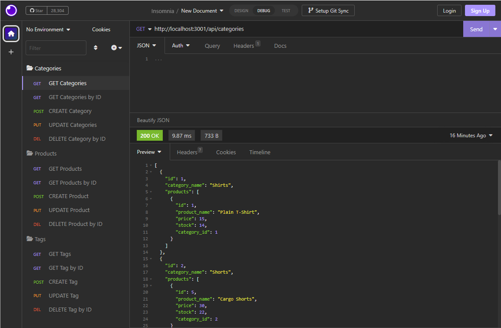

# HW-Challenge-13-E-Commerce-Back-End

## Description

Create a back end for a e-commerce website that uses the latest technologies so that the company can compete with other e-commerce companies

## Main Objectives

- When I add my database name, MySQL username, and MySQL password to an environment variable file I am able to connect to a database using Sequelize
- When I enter schema and seed commands a development database is created and is seeded with test data
- When I enter the command to invoke the application my server is started and the Sequelize models are synced to the MySQL database
- When I open API GET routes in Insomnia for categories products, or tags then the data for each of these routes is displayed in a formatted JSON
- When I test API POST, PUT, and DELETE routes in Insomnia I am able to successfully create, update, and delete data in my database

## Links

Walkthrough Video: https://drive.google.com/file/d/1TdsrS_1XrPCEQCtszvpCfMdRikYzHhWj/view

Repo: https://github.com/pg1219/HW-Challenge-13-E-Commerce-Back-End

## Mock-Up

Preview image of deployed application

